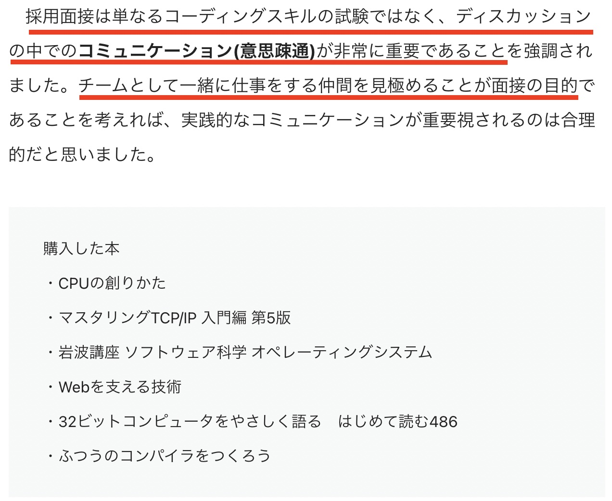

## YouTube動画の資料です
未経験からGoogleに入社する方法【ソフトウェアエンジニア】

https://youtu.be/sKIt8HYGmsM

# 未経験からGoogleに入社する方法
- 2年前に ある記事 がバズっていた
  - [【転職エントリ】Googleに入社します](https://note.com/neko_chan0214/n/n3a64bc1e1412)という記事
- 今回は その記事を 紹介する
- 再現性は低い
  - 99.9%の人が真似できない
- が, 0.1%でも学ぶことがある→動画つくってます
##
##
##
##
##

---

## なぜいまさら?(背景)
- 先月(2021年3月)の末に ある記事 がバズっていた
  - [Twitter で医師を拾ってきて Google のソフトウェアエンジニアにするだけの簡単なお仕事](https://nuc.hatenadiary.org/entry/2021/03/31)
- 「未経験からGoogleに転職成功した人」に対して Google面接対策支援 した
  - 元Googleのソフトウェアエンジニアの人
  - 模擬面接, CPUなどコンピューターサイエンスについての本紹介
- そこから競技プログラミング(主にAtCoder)の是非について議論が活発化へ
  - 今も継続中
##
##
##
##

---

## [【転職エントリ】Googleに入社します](https://note.com/neko_chan0214/n/n3a64bc1e1412) を要約すると

東大医学部出て医者になった人が Google までの転職成功させるまでの軌跡

- 中学生にしてBASICでプログラム書いてゲーム開発
- 数学オリンピック出場
- 東大理三(医学部)へ
- 医者へ
- ポーカーの戦略解析にハマり Pythonと出会い プログラム書く
- Progate→DataCampでPythonの独学
- 競技プログラミングにハマる
- Googleのリクルーターからメール
- 2,3ヶ月Googleの面接対策
- Twitterで元Googleの人からDM→模擬面接
- CSの本買って勉強

---

## この記事からわかったこと3つ
- ①未経験からでも クソ頑張れば Googleに入社できる可能性はある
  - 限りなく可能性低いが
- ②学位(情報科学科, コンピューターサイエンス科)がなくてもGoogleに入社できる
  - ただし同等の知識が必要
- ③競技プログラミングは Google へ転職に役立つこと
  - やりすぎ注意
##
##
##
##

---

## Googleへ入社する方法（最低限）
- 競技プログラミングを頑張ろう
- 情報科学(コンピューターサイエンス)の基礎知識をつけよう

##
##
##
##
##
##
##
##

---

### エンジニア転職を成功を目指すあなたへ: 記事の重要な箇所

---

## 購入されていた本 紹介
- [『CPUの創り方』渡波郁 ](https://amzn.to/3wy8vXN)
  - CPUの設計が自作しながらわかる. 平易な言葉で書かれてるので安心
  - CPU自作経験は財産になる(オサミーは持ってない)
  - プロセッサ技術の全体像を把握するには [『プロセッサを支える技術』Hisa Ando](https://amzn.to/3cSmqjj)もおすすめ
- [『マスタリングTCP/IP―入門編―(第6版)』井上直也 他](https://amzn.to/3wq4swn)
  - コンピューターネットワークの基礎を学べる. プロトコルとか
  - 先人の偉大さを知る. 「仕組みつくった人すげぇ！」
  - 仕組み(ルール)づくり側にまわりたかったらTCP/IPはマスト
- [『岩波講座 ソフトウェア科学 オペレーティングシステム』前川守](https://amzn.to/3sUgYSO)
  - オサミー未読
###
###
###

---

## 購入されていた本 紹介

- [『Webを支える技術-HTTP、URI、HTML、そしてREST』山本陽平](https://amzn.to/3rOQ3pS)
  - Webとは,Webの歴史,APIの設計(ただしRESTのみ)が学べる
  - 本来は[REST](https://ja.wikipedia.org/wiki/Representational_State_Transfer)だけでなく, [gRPC](https://ja.wikipedia.org/wiki/GRPC), [GraphQL](https://ja.wikipedia.org/wiki/GraphQL)も抑えるべし
  - [HTTP/2](https://ja.wikipedia.org/wiki/HTTP/2) , [HTML5](https://ja.wikipedia.org/wiki/HTML5)も抑えるべし
- [『32ビットコンピュータをやさしく語る　はじめて読む486』蒲地輝尚](https://amzn.to/3fJIdeR)
  - 1994年出版という古い本だが, 結構読みやすい(大学の教科書のような読みづらさはない)
  - x86系CPUのアーキテクチャを学べる
  - 仮想化技術は [『プロセッサを支える技術』Hisa Ando](https://amzn.to/3cSmqjj)を参考
- [『ふつうのコンパイラをつくろう』青木峰郎](https://amzn.to/2PFd01Z)
  - プログラム書いてから実行までの仕組みがわかる
  - コンパイラとは?ビルドとの違いとは?リンカとは?
###
###

---

## その他 おすすめ本
- [『30日でできる! OS自作入門 』川合秀実](https://amzn.to/2PY2DWA)
  - アセンブラとC言語でOSつくる! こちらも平易な言葉で書かれてる
  - が, たぶん30日ではできない
  - プログラミングとは=機械を操作するもの を実感できる
  - OS自作経験は財産になるしリスペクトされる(もちろんオサミーは以下略)
- [『プロセッサを支える技術』Hisa Ando](https://amzn.to/3cSmqjj)
  - プロセッサ技術の歴史や全体像を把握するのに最適. 
    - プロセッサを学ぶ 最初の1冊におすすめ
  - 仮想化や高速化技術を学べる (この本の主旨)
- [『プログラミングコンテストチャレンジブック』 秋葉拓哉 他](https://amzn.to/3fJuipf)
  - アルゴリズムをコード(C++)書きながら学べる
  - オサミーはこの道を通ってきてないから焦りがある.
    - やりたい
###

---

##### 動画で言いたいこと まとめ
## Keep Learning!
# 学習し続けよう
